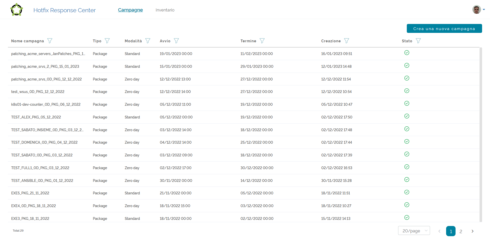
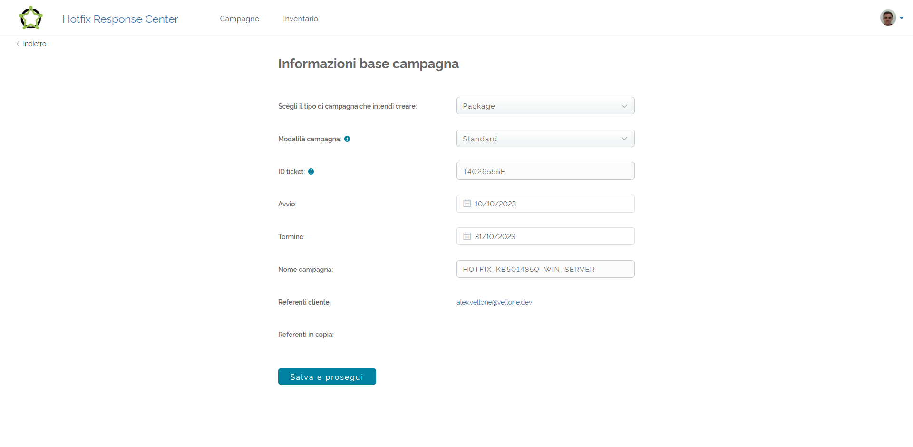
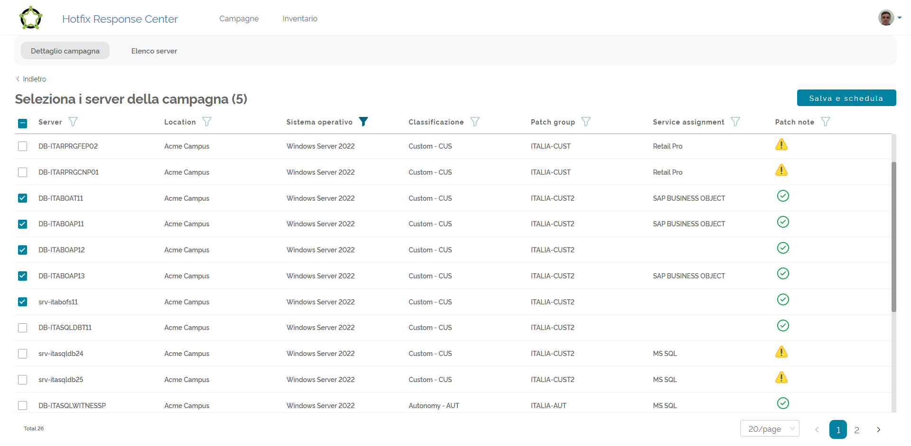
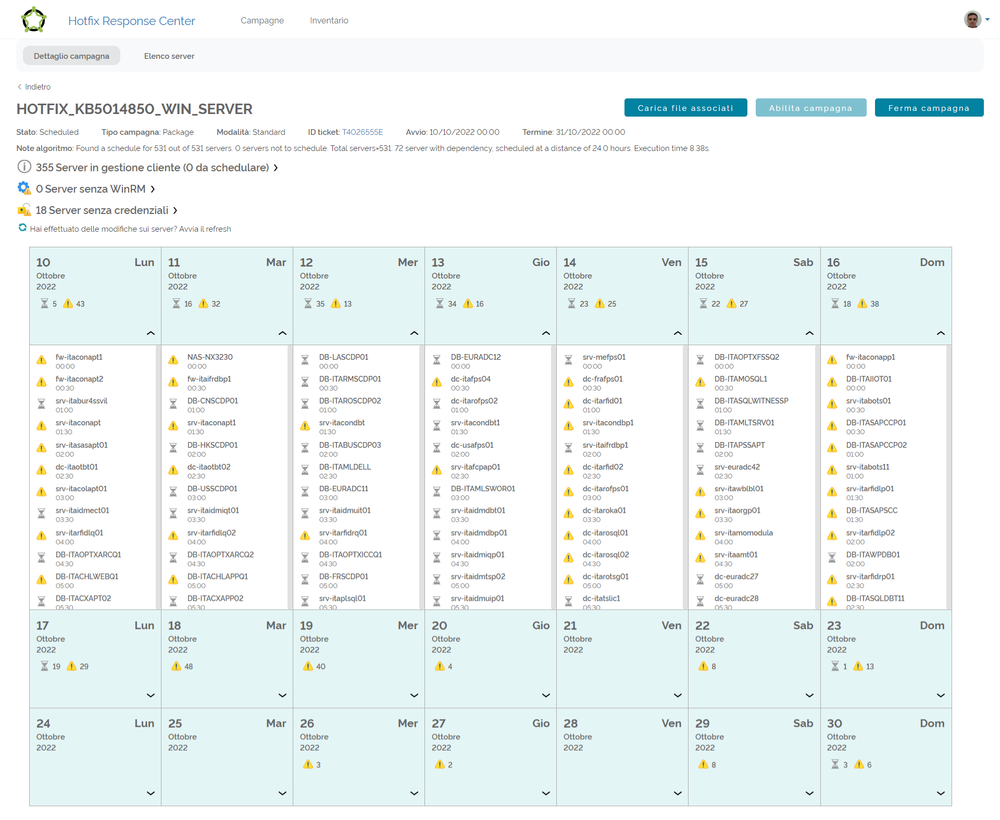
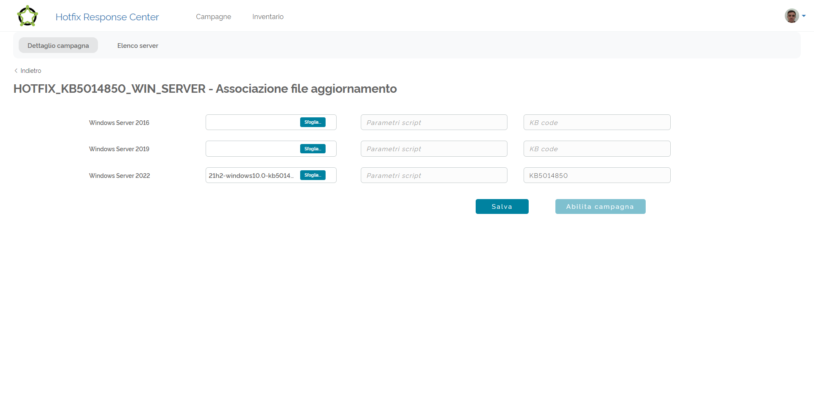
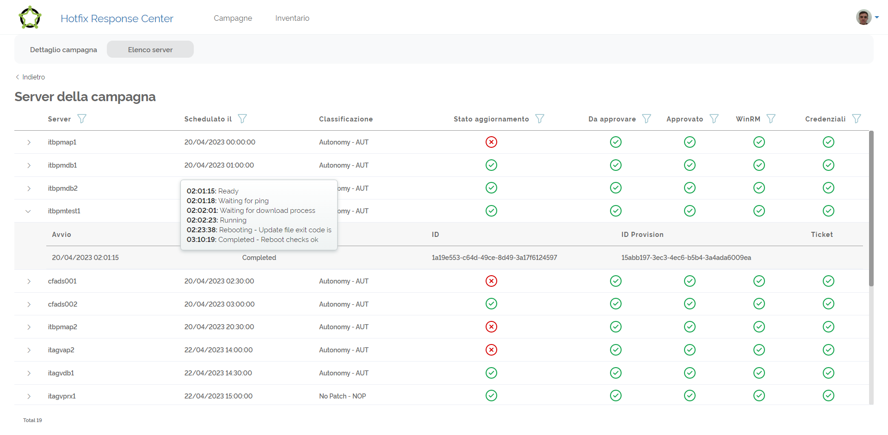
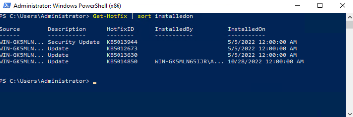

# My bachelor's thesis
Università degli studi dell'Insubria.

## Riassunto (italiano)
Al giorno d’oggi i software controllano praticamente ogni cosa: i nostri telefoni, le nostre
infrastrutture critiche, le nostre macchine, gli apparecchi medici e molto altro.

Le nostre infrastrutture tecnologiche sono quindi sempre più esposte a minacce e attacchi
informatici. Tali attacchi possono essere messi in atto sfruttando vulnerabilità presenti nei
sistemi informatici, mettendo a repentaglio la sicurezza delle aziende e/o delle infrastrutture
nazionali e in alcuni casi anche dei nostri dati.

Nel mio progetto di tesi, ho approfondito il tema delle vulnerabilità nei software, sviluppando
uno strumento semi-automatico in grado di gestire l’aggiornamento tempestivo e automatico
di centinaia di server affetti da vulnerabilità, per poter mettere in sicurezza i sistemi
informatici nel più breve tempo possibile.

Lo strumento realizzato è indipendente da qualsiasi altro strumento ed è composto da
un’interfaccia grafica (frontend, realizzato con il framework **Vue.js**), da dei servizi REST
(backend, realizzati in Python utilizzando il framework **Django**), da un database sql, da uno
storage per il caricamento dei file di aggiornamento e da due script necessari
all’installazione dell’aggiornamento di sicurezza, uno specifico per Windows (scritto in
**Powershell**) e uno per Linux (scritto in **Bash**).

Questo tool entra in gioco quando il vendor (produttore) del software che ha delle
vulnerabilità rilascia un aggiornamento per il suo software e inizia quindi la distribuzione
dell’aggiornamento che spesso non è automatica.

L'obiettivo del progetto è trovare una schedulazione ottimale per aggiornare tutti i server
della campagna, connettersi da remoto ai server e installare in modo autonomo
l'aggiornamento rilasciato dal produttore del software.
Le campagne di aggiornamento hanno una durata limitata in cui tutti i server devono avere a
disposizione due ore per essere aggiornati.

Per trovare una schedulazione ottimale l’algoritmo realizzato deve tenere in considerazione
diversi fattori, il più importante è la fascia di manutenzione. Per ogni server è definito un
periodo durante la settimana in cui può essere fuori servizio, per attività di manutenzione.
L’algoritmo sviluppato per la generazione del calendario di aggiornamento non è stato
sviluppato per trovare la soluzione ottimale, andando a provare ogni singola combinazione di
schedulazione, ma utilizza un approccio euristico per garantire in un tempo lineare una
schedulazione efficiente che è molto simile alla soluzione ottimale.

L’approccio euristico utilizza la conoscenza di un problema per trovare la soluzione a
problemi complessi in tempi ragionevoli. Tramite questo approccio, prima di cercare la
schedulazione dei server, viene calcolato un punteggio per ogni server, che dipende da vari
fattori (tra cui il numero di ore in cui il server è disponibile durante la settimana per la
manutenzione). Successivamente, partendo dai server con il punteggio più basso, si
procede in modo lineare all’assegnazione dei server alle varie fasce di manutenzione, della
campagna di aggiornamento.

In futuro è in programma lo sviluppo di ulteriori funzionalità per rendere automatica la
creazione delle campagne di aggiornamento, effettuando controlli proattivi sui software
installati nei server e verificando se sono affetti da vulnerabilità per cui è già disponibile un
aggiornamento.

## Screen

Per accedere al pannello di controllo dell’Hotfix Response Center, gli utenti 
possono visitare la pagina web privata tramite il proprio browser. 
Una volta effettuato l'accesso al portale, verrà visualizzato un elenco delle 
campagne già a sistema.

Per vedere i dettagli delle campagne precedentemente create basterà fare click 
sulla riga corrispondente. Invece, per creare una nuova campagna, gli utenti 
possono fare click sul bottone “Crea una nuova campagna” posizionato nell'angolo 
in alto a destra dell’interfaccia.

Una volta che l'utente schiaccia il bottone per creare una nuova campagna, Vue.js 
esegue l'azione di click e carica dinamicamente la pagina specifica dedicata alla 
creazione della campagna. 

Questa pagina offre all'utente un'interfaccia intuitiva per inserire tutte 
le informazioni necessarie per avviare il processo di creazione 
della campagna. Attraverso questa pagina, l'utente può fornire le informazioni di base, 
come il nome della campagna, la modalità di esecuzione e le date di inizio e di 
fine.

Nella pagine successive verranno mostrate le schermate relative alla creazione di 
una campagna di aggiornamento su tutti i Windows Server di un cliente, per installare
un aggiornamento cumulativo rilasciato da Windows con identificativo KB5014850 che
serve a risolvere delle vulnerabilità di sistema.

Al click del bottone “Salva e prosegui” verrà eseguito il codice JavaScript per 
fare una chiamata POST alle API del backend con la quale verranno passate tutte le 
informazioni inserite dell’utente e verrà salvata la campagna all’interno del 
database.

Successivamente verrà mostrata la schermata per selezionare i server impattati 
dalla vulnerabilità. Da questa schermata è possibile utilizzare i filtri per 
selezionare rapidamente solo i server che si vogliono aggiornare.

Dopo aver selezionato tutti i server impattati sarà sufficiente fare click sul 
bottone “Salva e schedula” per inviare l’elenco dei server al backend, sempre 
tramite le API REST. 
Il backend avvierà a questo punto l’algoritmo di schedulazione per trovare uno
slot di manutenzione adatto per l'aggiornamento di tutti i server.

Nella campagna selezionata sono stati inclusi 531 server, tutti pianificati con 
successo rispettando le rispettive finestre di manutenzione. Di questi, 72 sono 
stati considerati dipendenze e sono stati schedulati garantendo una separazione 
di 24 ore rispetto ai server di riferimento.

Per tutti i server della campagna è disponibile WinRM che consente quindi 
l'esecuzione automatica e remota degli aggiornamenti. Tuttavia, per 355 server 
è necessaria l'approvazione del cliente prima di procedere, mentre per 18 
server mancano le credenziali di connessione remota. Queste eccezioni sono 
segnalate nel calendario tramite un'icona di avviso, mentre per gli altri server 
gli aggiornamenti automatici partiranno nel rispettivo orario prestabilito.
I server con gli avvisi dovranno essere approvati per tempo dal cliente e 
l'operatore avrà del tempo per sistemare i problemi di credenziali sui 18 server.

Il calendario mostra un riepilogo, per ciascun giorno della campagna, 
consentendo di visualizzare i server schedulati nella giornata espandendo la 
settimana tramite un pulsante con una freccia verso il basso.

La pianificazione evidenzia in modo accurato come l'algoritmo abbia schedulato 
numerosi server nella prima settimana, riempiendo quasi completamente i 48 slot 
giornalieri disponibili. Nella terza settimana sono stati pianificati i server 
che presentano una programmazione più complessa a causa delle restrizioni imposte 
dalle finestre di manutenzione.

Prima dell'avvio della campagna, è necessario caricare i file di aggiornamento. 
In particolare, si mira a risolvere un gruppo di vulnerabilità nei sistemi 
operativi Windows Server utilizzando l'aggiornamento di sicurezza cumulativo 
con identificativo KB5014850, fornito da Microsoft.

Cliccando sul pulsante “Carica file associati”, si accede alla schermata dedicata 
al caricamento delle patch di sicurezza.

Considerando i 531 server selezionati, si rilevano tre diversi sistemi operativi: 
Windows Server 2016, Windows Server 2019 e Windows Server 2022. Per ognuno di 
questi sistemi operativi, è necessario caricare l'aggiornamento di sicurezza 
corretto, ottenibile dai canali ufficiali del fornitore del sistema operativo.

Una volta completato il caricamento, sarà possibile avviare la campagna mediante 
l'apposito pulsante “Abilita campagna”. Successivamente, l'Hotfix Response Center 
si occuperà dell'aggiornamento automatico e remoto dei server, eseguendo gli 
aggiornamenti secondo l'orario prestabilito.

Attraverso la schermata “Elenco server”, è possibile visualizzare lo stato di 
aggiornamento di ogni singolo server. Tale stato può assumere quattro possibili 
valori: “Aggiornamento in attesa”, “Aggiornamento in corso”, “Completato” o “Fallito”.

Nel caso specifico di un aggiornamento fallito, è possibile utilizzare 
l'interfaccia del calendario per programmare manualmente una nuova data, al fine 
di tentare un aggiornamento automatico successivo. Tale funzionalità garantisce 
un'ulteriore opportunità per risolvere eventuali problemi e completare con 
successo l'aggiornamento del server interessato.

Nella maggior parte dei casi, l'aggiornamento risulta fallire a causa di server 
non raggiungibili o di credenziali di connessione non corrette. Quando ciò accade, 
è richiesto un intervento manuale per risolvere il problema prima di riprovare 
l'aggiornamento automatico. Per questo motivo si è deciso di lasciare all’operatore 
la decisione sulla scelta di una nuova data, per ritentare l'aggiornamento automatico.

### Conferma aggiornamento
L’Hotfix Response Center è autonomamente in grado di riconoscere se 
l'aggiornamento è stato installato o meno sul server capendo anche se è 
necessario un riavvio per poterlo applicare correttamente.

In ogni caso, per verificare la corretta applicazione dell'aggiornamento di 
sicurezza applicato dalla campagna presa in analisi, è sufficiente collegarsi al 
server e verificare manualmente l’installazione lanciando il comando “Get-Hotfix” 
su una console Powershell con privilegi di amministratore.

Nel server in questione possiamo notare che l'ultimo aggiornamento installato è
proprio l'aggiornamento cumulativo KB5014850 che conferma quindi l'installazione
remota e automatica dell'aggiornamento di sicurezza, attraverso la campagna di Hotfix.

### Templates
Template authors: Ignazio Gallo, Nicola Landro, Moreno Carullo

Template license: Creative Commons CC BY 4.0

https://it.overleaf.com/latex/templates/thesis-template-university-of-insubria/mzvgrycczbcc

Copyrigth 2023 Alex Vellone
